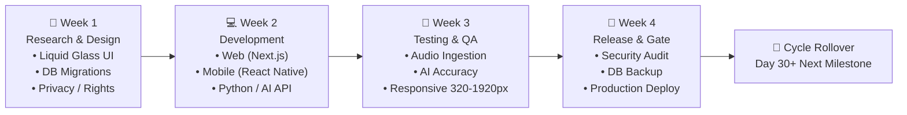
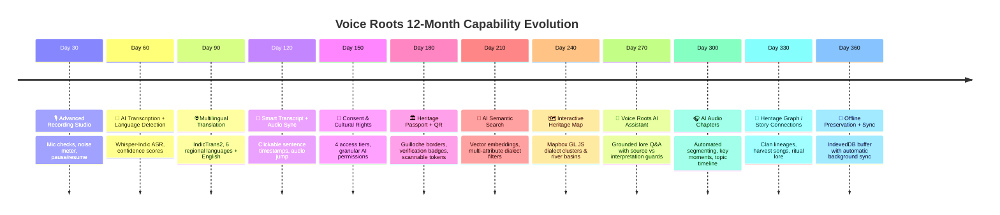

# 🌿 Voice Roots — 30-Day Feature Release System & 12-Month Engineering Roadmap

> **“A voice should not disappear just because it was never written down.”**  
> **Core Principle:** Every release expands the oral-heritage intelligence layer while preserving existing recordings, transcripts, consent settings, and Heritage Passports untouched.

---

## 1. 🔄 The 30-Day Operational Cadence

Every 30 days, Voice Roots delivers one major, production-grade capability across both the **Website** and **Mobile App** following a disciplined 4-week engineering lifecycle:



### Weekly Deliverables Breakdown

| Week | Focus | Core Outputs |
| :--- | :--- | :--- |
| **Week 1** | **Research & Design** | • Liquid Glass UI mockups & interaction specs<br/>• Database migration script (`supabase/migrations/`)<br/>• API payload schema (`app/schemas/`)<br/>• Indigenous consent & cultural privacy matrix |
| **Week 2** | **Full-Stack Development** | • Frontend implementation in Next.js 14 App Router<br/>• Mobile implementation in React Native / Expo<br/>• Python FastAPI backend endpoints & background tasks<br/>• Neural model inference bindings (Whisper / IndicTrans2 / LLM) |
| **Week 3** | **Integration & Verification** | • Audio hardware stress tests (mic permissions, latency, formats)<br/>• AI hallucination checks and translation accuracy audits<br/>• Cross-viewport responsive testing (`320px` to `1920px`)<br/>• RBAC & Row Level Security (RLS) penetration tests |
| **Week 4** | **Security Gate & Deployment** | • 11-step pre-release security verification<br/>• Automated production build (`npm run build`, Docker validation)<br/>• Zero-downtime database migration & snapshot backup<br/>• Release notes publication & community documentation |

---

## 2. 🗓️ The 12-Month Master Release Schedule



### Detailed Monthly Specifications

| Release | Milestone | Key Capabilities Delivered | Dual Platform Scope |
| :---: | :--- | :--- | :--- |
| **Day 30** | **🎙️ Advanced Recording Studio** | Real-time Web Audio API waveform, noise-floor meter, audio quality indicator, pause/resume, lossless 48kHz WAV buffer. | Web (`/record`) + Mobile (`RecordScreen`) |
| **Day 60** | **🤖 AI Transcription & Detection** | Multi-dialect identification, Whisper-Indic ASR, word-level confidence scoring, low-confidence token highlighting. | Web (`/upload`, `/record`) + Mobile |
| **Day 90** | **🌐 Multilingual Translation** | IndicTrans2 translation layer across Telugu, Hindi, Tamil, Kannada, Malayalam, and English. Preserves source transcript untouched. | Web (`/translate`, `/recordings/[id]`) + Mobile |
| **Day 120** | **📝 Smart Transcript & Audio Sync** | Click-to-seek playback (tapping sentence jumps audio player), inline community transcript editor, revision history trail. | Web (`/recordings/[id]`) + Mobile |
| **Day 150** | **🔐 Consent & Cultural Rights** | Indigenous Data Sovereignty controls: Public, Community, Private, Restricted. Granular AI checkboxes (ASR, Translation, Metadata). | Web (`RecordingStudio`) + Mobile |
| **Day 180** | **🏛️ Heritage Passport + QR** | Liquid Glass verified credential, guilloche security border, verification cycler (`AI` $\rightarrow$ `Human` $\rightarrow$ `Community ✓`), camera-scannable QR token. | Web (`/passport/[id]`) + Print / Share |
| **Day 210** | **🔎 AI Semantic Search** | Vector semantic search by cultural themes (e.g. "harvest songs", "neem remedies"), cross-filtered by region, dialect, and duration. | Web (`/search`) + Mobile |
| **Day 240** | **🗺️ Interactive Heritage Map** | Mapbox GL JS oral topography, state/basin dialect pins, audio preview cards on hover, clan migration paths. | Web (`/explore`) + Mobile |
| **Day 270** | **💬 Voice Roots AI Assistant** | Grounded oral heritage assistant. Strictly distinguishes **Source Evidence** from **AI Interpretation** to prevent cultural hallucination. | Floating AI Drawer across Web & Mobile |
| **Day 300** | **🎧 AI Audio Chapters** | Unsupervised topic segmentation, timestamped chapter markers, key moment bookmarks, speaker turns. | Web (`/recordings/[id]`) + Mobile |
| **Day 330** | **🔗 Heritage Graph & Connections** | Graph neural network mapping oral relationships: Songs $\leftrightarrow$ Stories $\leftrightarrow$ Rituals $\leftrightarrow$ Ecological seasons. | Web (`/explore/graph`) + Mobile |
| **Day 360** | **📱 Offline Preservation & Sync** | Progressive Web App (PWA) with Service Worker & IndexedDB local queue. Automatic background sync to Supabase upon internet reconnection. | Web PWA + Native Mobile Background Sync |

---

## 3. 🛡️ The Non-Negotiable Law: Zero Data Breakage

> [!CAUTION]
> **New Feature $\neq$ Application Rewrite.**  
> Every 30-day release must be 100% backward-compatible. Under no circumstances may an upgrade invalidate previous recordings, change original acoustic audio, overwrite source transcripts, break existing Heritage Passports, or alter published QR code URLs.

### Backward-Compatibility Guarantees:
1. **Immutable Acoustic Masters:** Original raw audio files stored in `/audio/` or Supabase storage buckets are append-only and strictly read-only.
2. **Layered Data Architecture:** AI transcripts, translations, and cultural context are stored as *additive metadata layers* on top of the original record, never replacing the source text.
3. **Persistent QR Codes & Record IDs:** All issued Heritage Passport IDs (`VR-2026-XXXX`) and their corresponding public URLs remain permanently resolvable.
4. **Versioned REST API Endpoints:** Public and internal APIs follow semantic versioning (`/api/v1/recordings`, `/api/v2/...`). Existing clients continue functioning uninterrupted.
5. **Declarative Database Migrations:** All schema alterations use non-destructive PostgreSQL migrations (`ADD COLUMN IF NOT EXISTS`, backward-compatible default values).

---

## 4. 🔐 The 11-Step Security & Cultural Integrity Gate

Before any 30-day release is promoted to production, it must successfully pass all 11 stages of the pre-flight verification gate:

```text
  [1] FEATURE_COMPLETE
          │
  [2] UNIT_TESTS (Jest / Pytest)
          │
  [3] AI_ACCURACY_TESTS (WER & BLEU regression verification)
          │
  [4] ACCESS_CONTROL (Row Level Security & RBAC verification)
          │
  [5] CONSENT_CHECK (Speaker consent flags verified)
          │
  [6] DATA_PRIVACY_CHECK (No PII exposure without explicit consent)
          │
  [7] PERFORMANCE_TEST (Audio streaming latency < 200ms)
          │
  [8] MOBILE_TEST (iOS Safari & Android Chrome verification)
          │
  [9] WEB_TEST (Responsive layout across 320px → 1920px)
          │
  [10] SNAPSHOT_BACKUP (PostgreSQL & Audio storage backup)
          │
  [11] PRODUCTION_RELEASE 🚀
```

---

## 5. 📱 Unified Dual-Platform Architecture

Both the **Web Platform** and the **Mobile App** operate against the exact same backend contracts, ensuring zero duplicated business logic or out-of-sync schemas:

```text
                     🌿 VOICE ROOTS CORE
                              │
               ┌──────────────┴──────────────┐
               │                             │
        💻 Web Platform               📱 Mobile App
     (Next.js 14 App Router)       (React Native / Expo)
               │                             │
               └──────────────┬──────────────┘
                              │
                    Unified Shared Backend
           ├── FastAPI REST Endpoints (/api/v1)
           ├── Supabase PostgreSQL + Row Level Security
           ├── Supabase Audio Storage Buckets
           └── Hugging Face Speech & Translation Microservices
```

---

## 6. ⏰ Automated 30-Day Cycle Schedule

To ensure this operational discipline is maintained permanently, a recurring schedule task has been initialized:

- **Schedule ID:** `task-2641`
- **Cadence:** Every 30 days (`0 9 1 * *`)
- **Action:** Triggers automated regression verification, reviews the 12-month roadmap milestone, runs security gate checks, and initiates the development sprint for the next major capability.
