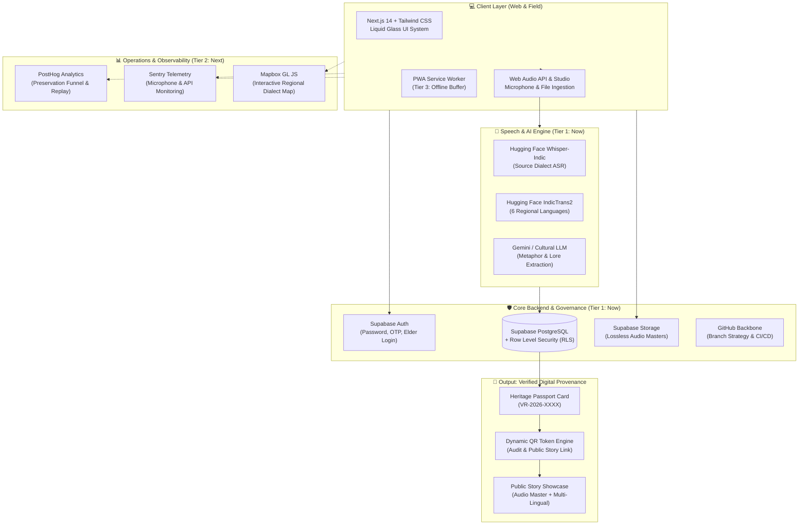
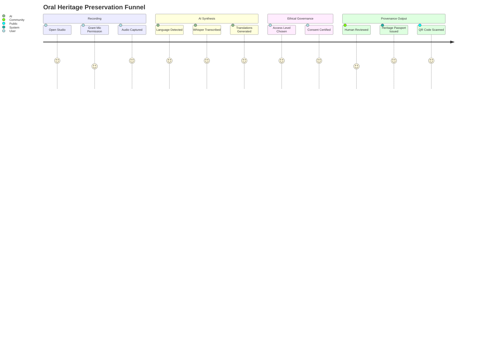

# 🌿 Voice Roots — Production Technology Stack & Roadmap
### *Strategic Architectural Blueprint for Scalable Oral Heritage Preservation*

> **“A voice should not disappear just because it was never written down.”**

---

## 1. 🏛️ Executive Philosophy: Strategic Tool Addition

Voice Roots already features a complete, battle-tested AI pipeline (Acoustic Processing, Language Identification, Speech-to-Text, IndicTrans2 Translation, and Cultural Lore Extraction). Adding more AI models would result in unnecessary complexity. 

Instead, our production roadmap adds **operational infrastructure, data governance, reliability, and user discovery** tools strategically across three prioritized deployment horizons:



---

## 2. 📅 Strategic Implementation Horizons

| Horizon | Priority | Tools / Components | Strategic Impact |
| :--- | :---: | :--- | :--- |
| **Tier 1: NOW** | ⭐⭐⭐⭐⭐ | **Supabase**, **GitHub**, **Hugging Face**, **Heritage Passport**, **Human Verification** | Production data layer, strict Row Level Security (RLS), source control backbone, and the signature provenance innovation. |
| **Tier 2: NEXT** | ⭐⭐⭐⭐ | **Mapbox GL JS**, **PostHog**, **Sentry** | Visual geospatial discovery across India's linguistic landscape, funnel telemetry, and audio error debugging. |
| **Tier 3: LATER** | ⭐⭐⭐ | **PWA**, **Background Offline Sync** | Field-worker offline recording in remote tribal/forest areas with automatic upload upon reconnection. |

---

## 3. 🛡️ Tier 1 (Immediate Core): Supabase + GitHub + Hugging Face

### 3.1 Supabase: PostgreSQL, RLS, Auth & Storage
Instead of managing fragmented microservices, Supabase consolidates the data, file, and security layers:
- **Authentication**: Email/Password, phone OTP for village elders, and Community Custodian role-based access.
- **Row Level Security (RLS)**: Enforces Indigenous Data Sovereignty by strictly restricting access according to the community's chosen access tier:
  - `public`: Visible to everyone.
  - `community`: Visible only to authenticated members of that specific linguistic or tribal group.
  - `private` / `restricted`: Accessible only to clan elders and designated family custodians.
- **Storage Buckets**: High-fidelity 48kHz WAV audio masters stored in private/public buckets with signed CDN URLs.

#### Complete PostgreSQL Schema (`supabase/migrations/20261006_heritage_schema.sql`)
```sql
-- 1. Enum Types
CREATE TYPE access_level AS ENUM ('public', 'community', 'private', 'restricted');
CREATE TYPE verification_status AS ENUM ('DRAFT', 'AI_PROCESSED', 'HUMAN_REVIEWED', 'CONSENT_CONFIRMED', 'COMMUNITY_VERIFIED', 'PUBLISHED');

-- 2. Heritage Stories Table
CREATE TABLE heritage_records (
    id UUID PRIMARY KEY DEFAULT gen_random_uuid(),
    record_id VARCHAR(32) UNIQUE NOT NULL, -- e.g. 'VR-2026-0106'
    title TEXT NOT NULL,
    language VARCHAR(64) NOT NULL,
    dialect VARCHAR(128),
    community VARCHAR(128),
    location TEXT,
    coordinates POINT, -- GeoJSON Point (longitude, latitude) for Mapbox
    audio_path TEXT NOT NULL,
    audio_duration_seconds INTEGER NOT NULL,
    source_transcript TEXT NOT NULL,
    translations JSONB NOT NULL DEFAULT '{}'::jsonb,
    cultural_context TEXT,
    access_level access_level NOT NULL DEFAULT 'public',
    verification_status verification_status NOT NULL DEFAULT 'AI_PROCESSED',
    verified_by TEXT,
    verified_at TIMESTAMPTZ,
    contributor_id UUID REFERENCES auth.users(id),
    created_at TIMESTAMPTZ NOT NULL DEFAULT NOW()
);

-- 3. Ethical Consent & Custodianship Ledger
CREATE TABLE consent_ledger (
    id UUID PRIMARY KEY DEFAULT gen_random_uuid(),
    record_id UUID REFERENCES heritage_records(id) ON DELETE CASCADE,
    speaker_consent BOOLEAN NOT NULL DEFAULT TRUE,
    allow_transcription BOOLEAN NOT NULL DEFAULT TRUE,
    allow_translation BOOLEAN NOT NULL DEFAULT TRUE,
    allow_cultural_metadata BOOLEAN NOT NULL DEFAULT TRUE,
    access_tier access_level NOT NULL DEFAULT 'public',
    witness_notes TEXT,
    consent_timestamp TIMESTAMPTZ NOT NULL DEFAULT NOW()
);

-- 4. Verification Audit Trail
CREATE TABLE verification_audit_trail (
    id UUID PRIMARY KEY DEFAULT gen_random_uuid(),
    record_id UUID REFERENCES heritage_records(id) ON DELETE CASCADE,
    previous_status verification_status,
    new_status verification_status NOT NULL,
    actor_id UUID REFERENCES auth.users(id),
    actor_name TEXT NOT NULL,
    notes TEXT,
    created_at TIMESTAMPTZ NOT NULL DEFAULT NOW()
);

-- 5. Row Level Security (RLS) Policies
ALTER TABLE heritage_records ENABLE ROW LEVEL SECURITY;

-- Policy: Public records are viewable by anyone
CREATE POLICY "Public heritage records are universally readable"
ON heritage_records FOR SELECT
USING (access_level = 'public');

-- Policy: Community records readable only by verified community members
CREATE POLICY "Community records readable by authorized community members"
ON heritage_records FOR SELECT
TO authenticated
USING (
    access_level = 'community' AND 
    auth.jwt() ->> 'community' = community
);

-- Policy: Contributor or Elder Council can update records
CREATE POLICY "Contributors and Elders can manage records"
ON heritage_records FOR ALL
TO authenticated
USING (auth.uid() = contributor_id OR auth.jwt() ->> 'role' = 'elder_council');
```

### 3.2 GitHub Repository Structure & Branching Strategy
A clean monorepo architecture with protected main branches and automated PR reviews:

```text
voice-roots/
├── .github/
│   └── workflows/
│       ├── test-and-lint.yml        # Next.js build + TypeScript check
│       └── deploy.yml               # Automated Vercel / Cloudflare preview
├── web/                             # Next.js 14 Frontend & API routes
│   ├── src/
│   │   ├── app/
│   │   │   ├── passport/[id]/       # Liquid Glass Heritage Passport
│   │   │   ├── recordings/[id]/     # Story Details Dossier
│   │   │   ├── upload/              # File Ingestion Studio
│   │   │   ├── translate/           # Day-to-Day Conversational Translator
│   │   │   └── explore/             # Heritage Archive & Map
│   │   └── components/
│   └── public/                      # Static assets & sample audio masters
├── ai_pipeline/                     # Python / FastAudio AI microservices
│   ├── asr/                         # Whisper-Indic inference handlers
│   ├── translation/                 # IndicTrans2 endpoint connectors
│   └── context/                     # Cultural metadata extraction
├── supabase/                        # Database migrations & seed scripts
│   └── migrations/
└── docs/                            # Master specifications, demo script & guides
```

#### Git Branching Model:
- `main`: Production release branch (deployed to production).
- `develop`: Integration staging branch.
- `feature/heritage-passport`: Passport card, verification cycling, and QR generation.
- `feature/heritage-map`: Mapbox GL JS spatial clustering.
- `feature/ai-telemetry`: PostHog & Sentry integration.

### 3.3 Hugging Face: Open-Source Speech & Translation AI
- **`ai4bharat/indicwav2vec-hindi` / Whisper-Indic**: Fine-tuned for phonetically rich Indian languages and under-resourced dialects.
- **`ai4bharat/indictrans2-indic-indic-1B`**: State-of-the-art multilingual translation tailored for 22 scheduled Indian languages, preserving dialect-specific honorifics and cultural metaphors.

---

## 4. 🗺️ Tier 2 (Next Operations): Mapbox + PostHog + Sentry

### 4.1 Mapbox GL JS: Cultural Oral Topography
Instead of flat text lists, users discover stories through an interactive geographical interface:
- **Discovery Cascade**:
  $$\text{Interactive India Map} \longrightarrow \text{State / River Basin} \longrightarrow \text{Community Cluster} \longrightarrow \text{Regional Dialect} \longrightarrow \text{Stories}$$
- **Features**:
  - Custom dark terrain style highlighting river basins (Godavari, Krishna, Narmada, Ganga).
  - Dialect cluster pins with hover audio previews.
  - Filter pins by language family: Dravidian, Indo-Aryan, Austroasiatic (Munda), and Tibeto-Burman.

### 4.2 PostHog: Preservation Funnel & Engagement Analytics
PostHog tracks real user interactions across the preservation lifecycle:



#### Core PostHog Event Schema:
```typescript
posthog.capture("story_recorded", {
  language: "Telugu",
  dialect: "Northern Telangana",
  duration_seconds: 184,
  source: "live_microphone"
});

posthog.capture("consent_confirmed", {
  access_level: "public",
  transcription_permitted: true,
  translation_permitted: true,
  cultural_lore_permitted: true
});

posthog.capture("passport_issued", {
  record_id: "VR-2026-0106",
  verification_status: "COMMUNITY_VERIFIED",
  qr_token: "qr_token_vr-2026-0106"
});

posthog.capture("passport_qr_scanned", {
  record_id: "VR-2026-0106",
  referrer: "camera_qr_scan"
});
```

### 4.3 Sentry: Audio Recording & API Reliability Monitoring
Field audio collection is prone to device edge cases:
- Capturing `NotAllowedError` when microphones are denied.
- Catching `MediaRecorder` encoding failures on older Android/iOS devices.
- Tracking API latency and timeouts during heavy IndicTrans2 translation requests.
- Automatic breadcrumbs tracking user actions before audio failures occur.

---

## 5. 📱 Tier 3 (Field Hardening): PWA & Offline Sync

### 5.1 Progressive Web App (PWA)
- Installable directly to home screen on Android and iOS without app store friction.
- Service worker caching for the Liquid Glass shell, fonts, and core offline UI.
- Native device integration: Web Audio API, wake lock to prevent screen sleep while recording elders.

### 5.2 Offline Rural Field Synchronization
- **Problem**: Story collectors frequently record in remote valleys and tribal hamlets without mobile coverage.
- **Solution**:
  1. High-fidelity audio and metadata are written immediately to browser **IndexedDB**.
  2. Local status marked as `CACHED_OFFLINE`.
  3. Service worker monitors `navigator.onLine` and `BackgroundSyncManager`.
  4. Once network connectivity is restored, audio files and transcripts stream automatically to **Supabase Storage** and PostgreSQL.

---

## 6. 🏆 Summary: The Voice Roots Strategic Architecture Matrix

```text
 🌿 VOICE ROOTS ARCHITECTURE
  │
  ├── 📱 PRESENTATION TIER
  │    ├── Next.js 14 App Router + React 18
  │    ├── Liquid Glass Visual System
  │    ├── Heritage Passport UI (Front & Dossier)
  │    └── PWA Offline Shell (Tier 3)
  │
  ├── 🛡️ DATA & GOVERNANCE TIER (Tier 1: Now)
  │    ├── Supabase PostgreSQL (Heritage Stories, Transcripts)
  │    ├── Supabase Row Level Security (RLS) (Access Controls)
  │    ├── Supabase Storage Buckets (Lossless Master Audio)
  │    └── Supabase Auth (Elder & Community Custodians)
  │
  ├── 🧠 SPEECH & INTELLIGENCE TIER (Tier 1: Now)
  │    ├── Hugging Face Whisper-Indic (Source Dialect ASR)
  │    ├── Hugging Face IndicTrans2 (6-Language Translation)
  │    └── Gemini LLM (Ethnobotanical & Lore Extraction)
  │
  ├── ⚙️ PRODUCTION OPERATIONS TIER (Tier 2: Next)
  │    ├── Mapbox GL JS (Regional Linguistic Topography)
  │    ├── PostHog Analytics (Preservation Funnels & Retention)
  │    └── Sentry (Audio Hardware & API Reliability)
  │
  └── 📜 PROVENANCE & PUBLIC ACCESS TIER
       ├── Unique QR Token Engine
       ├── Verification Status Ledger (AI → Human → Community ✓)
       └── Verified Public Oral Heritage Story Page
```

This stack guarantees that **Voice Roots** is not merely a prototype, but an **institution-grade, culturally sovereign, and field-ready oral heritage platform**.
