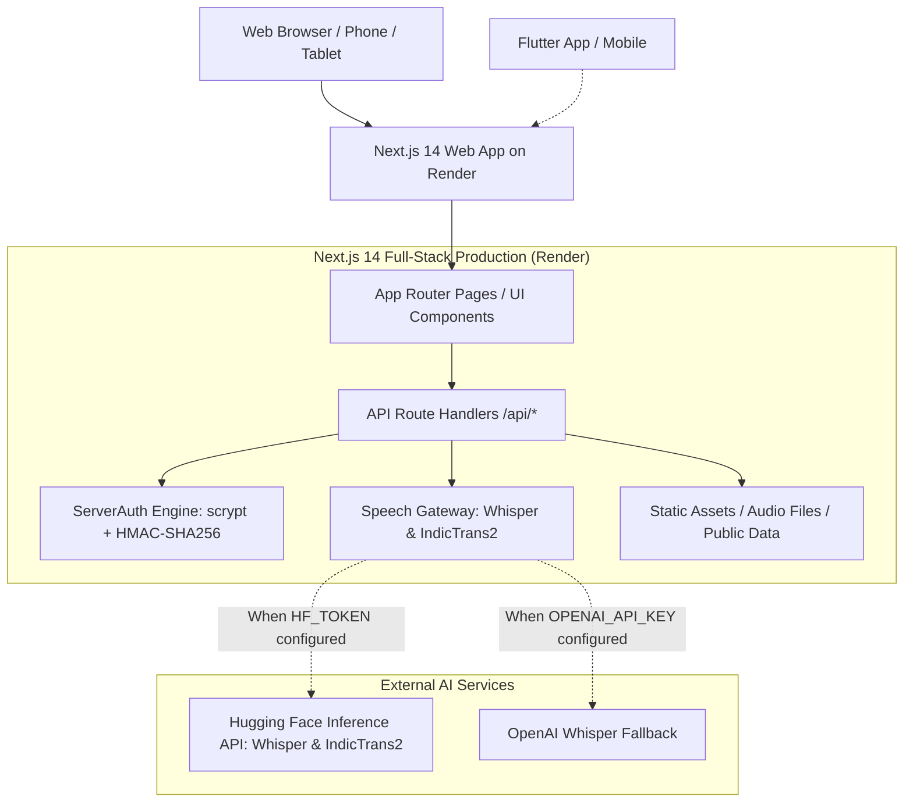

# Voice Roots — System Architecture

## 1. High-Level Architecture Overview

Voice Roots follows a decoupled, resilient architecture designed for web and mobile clients with offline-first capabilities:

---

## 2. Component Boundaries

### A. Next.js Web Application (`web/`)
- **Primary Deployed Artifact**: Live on Render (`https://voice-roots.onrender.com`).
- **Framework**: Next.js 14 (App Router) with React 18, TypeScript, and Tailwind CSS.
- **Role**: Serves both public UI pages and internal API endpoints (`/api/*`).
- **Execution**: Node.js 20 runtime (`npm run start -- -p $PORT -H 0.0.0.0`).

### B. Python FastAPI Backend (`backend/`)
- **Framework**: Python 3.11+, FastAPI, SQLAlchemy, Alembic, PostgreSQL, Redis, Celery.
- **Role**: Companion service for complex asynchronous background worker pipelines, bulk batch migrations, and local containerized deployments.

### C. Mobile Clients (`flutter_app/` & `mobile/`)
- **`flutter_app/`**: Native cross-platform Flutter application sharing the iOS-inspired dark-blue tokens (`theme.dart`).
- **`mobile/`**: React Native / Expo prototype client.

---

## 3. Data Flow & Speech Pipeline

### A. Speech-to-Text (STT) Flow
1. User selects or records audio in `/upload`.
2. Audio bytes packaged into `multipart/form-data` and sent to `POST /api/transcribe`.
3. Server validates MIME type (`audio/wav`, `audio/mpeg`, `audio/mp4`, `audio/webm`, `audio/ogg`) and file size (&le; 25MB).
4. If `HF_TOKEN` or `OPENAI_API_KEY` is present, audio streams to the external inference provider.
5. Verbatim transcript returned to frontend with metadata.
6. Transcript rendered into an editable textarea for elder or linguist review before translation.

### B. Translation Pipeline Flow
1. Reviewed transcript and language pair sent to `POST /api/translate`.
2. Server first queries the curated indigenous dialogue corpus for exact linguistic matches.
3. If no exact corpus match, queries the neural translation gateway (IndicTrans2) using Hugging Face inference.
4. Generates a SHA-256 cryptographic provenance hash combining source text, translated text, and language codes.
5. Returns translation and provenance record to the frontend.

---

## 4. Authentication Architecture

- **Password Storage**: Cryptographic salt (16 bytes random hex) + `crypto.scryptSync(password, salt, 64)` producing 128-character hex digests.
- **Session Tokens**: Signed tokens (`vr_sess_<base64url(userId:email:timestamp)>_<hmacSignature>`) with 7-day expiration.
- **Comparison Security**: Verified using `crypto.timingSafeEqual` to eliminate timing attacks.
- **Rate Limiting**: Sliding-window in-memory limiter (10 attempts per minute per IP) to mitigate brute-force attacks.
- **Client Sync**: Broadcast events (`vr-auth-changed`) and cookie storage ensure instant state synchronization across header, drawer, and bottom navigation components.
